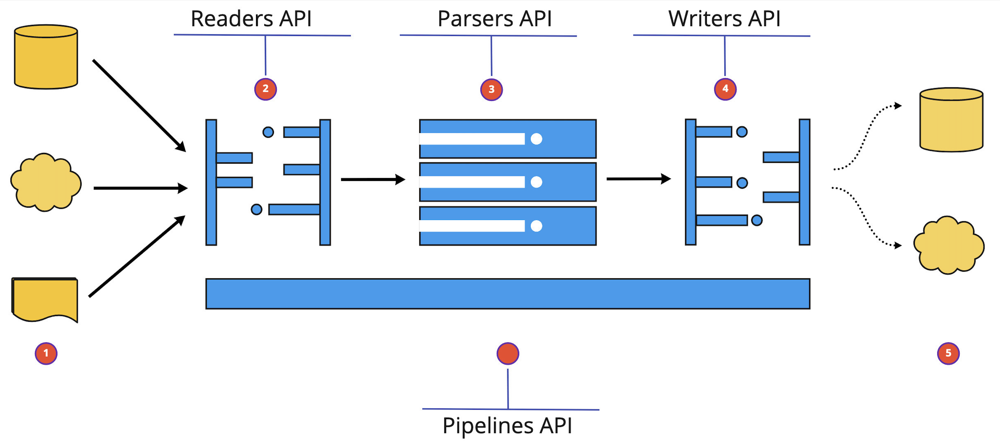

# ocrpy

[](https://pepy.tech/project/ocrpy)


__Unified interface to google vision, aws textract, azure, tesseract and other OCR tools__

The core objective of `ocrpy` is to let users perform OCR, archive, index and search any document with ease, providing an intuitive interface and a powerful Pipeline API to solve common OCR-based tasks.

`ocrpy` achieves this by wrapping around the most popular OCR engines like [Tesseract OCR](https://tesseract-ocr.github.io/), [Aws Textract](https://aws.amazon.com/textract/), [Google Cloud Vision](https://cloud.google.com/vision/docs/ocr) and [Azure Computer Vision](https://azure.microsoft.com/en-in/services/cognitive-services/computer-vision/#features). It unifies the multitude of interfaces provided by a wide range of cloud tools & other open-source libraries under a common and easy-to-use interface for the user.



## Getting Started

`ocrpy` is a Python-only package hosted on [PyPI](https://pypi.org/project/ocrpy/).
The recommended installation method is [pip](https://pip.pypa.io/en/stable/)

```bash
pip install ocrpy
```

## Day-to-Day Usage

`ocrpy` provides various levels of abstraction for the user to perform OCR on different types of documents. The recommended and the best way to use `ocrpy` is through it's `pipeline` API as shown below.

The Pipeline API can be invoked in two ways. The first method is to define the config for running the pipeline as a yaml file and and then run the pipeline by loading it as follows: 

```python

   from ocrpy import TextOcrPipeline

   ocr_pipeline = TextOcrPipeline.from_config("ocrpy_config.yaml")
   ocr_pipeline.process()
```

Alternatively you can run a pipeline by directly instantiating the pipeline class as follows:

```python

   from ocrpy import TextOcrPipeline

   pipeline = TextOcrPipeline(source_dir='s3://document_bucket/', 
                              destination_dir="gs://processed_document_bucket/outputs/", 
                              parser_backend='aws-textract', 
                              credentials_config={"AWS": "path/to/aws-credentials.env/file", 
                                           "GCP": "path/to/gcp-credentials.json/file"})
   pipeline.process()
```

> :memo: For a more detailed set of examples and tutorials on how you could use ocrpy for your use case can be found at [ocrpy documentation](https://maxentlabs.com/ocrpy/).

## Support and Documentation

* For an in-depth reference of the `ocrpy` API refer to our [API docs](https://maxentlabs.com/ocrpy/api-reference.html).
* For inspiration on how to use ocrpy for your usecase, check out our [tutorials](https://maxentlabs.com/ocrpy/tutorials.html) or our [examples](https://maxentlabs.com/ocrpy/examples.html).
* If you're interested in understanding how ocrpy works, check out our [Ocrpy Overview](https://maxentlabs.com/ocrpy/overview.html).

## Feedback and Contributions

* If you have any questions, Feedback or notice something wrong, please open an issue on [GitHub Issues](https://github.com/maxent-ai/ocrpy/issues/).
* If you are interested in contributing to the project, please open a PR on [GitHub Pull Requests](https://github.com/maxent-ai/ocrpy/pulls).
* Or if you just want to say hi, feel free to [contact us](info@maxentlabs.com).

## Citation

If you wish to cite this project, feel free to use this [BibTeX](http://www.bibtex.org/) reference:

```bibtex
@misc{ocrpy,
    title={Ocrpy: OCR, Archive, Index and Search any documents with ease},
    author={maxentlabs},
    year={2022},
    publisher = {GitHub},
    howpublished = {\url{https://github.com/maxent-ai/ocrpy}}
}
```

## License and Credits

* `ocrpy` is licensed under the [MIT](https://choosealicense.com/licenses/mit/) license.
The full license text can be also found in the [source code repository](https://github.com/maxent-ai/ocrpy/blob/main/LICENSE).
* `ocrpy` is written and maintained by [Bharath G.S](https://github.com/bharathgs) and [Rita Anjana](https://github.com/AnjanaRita).
* A full list of contributors can be found in [GitHub's overview](https://github.com/maxent-ai/ocrpy/graphs/contributors).
